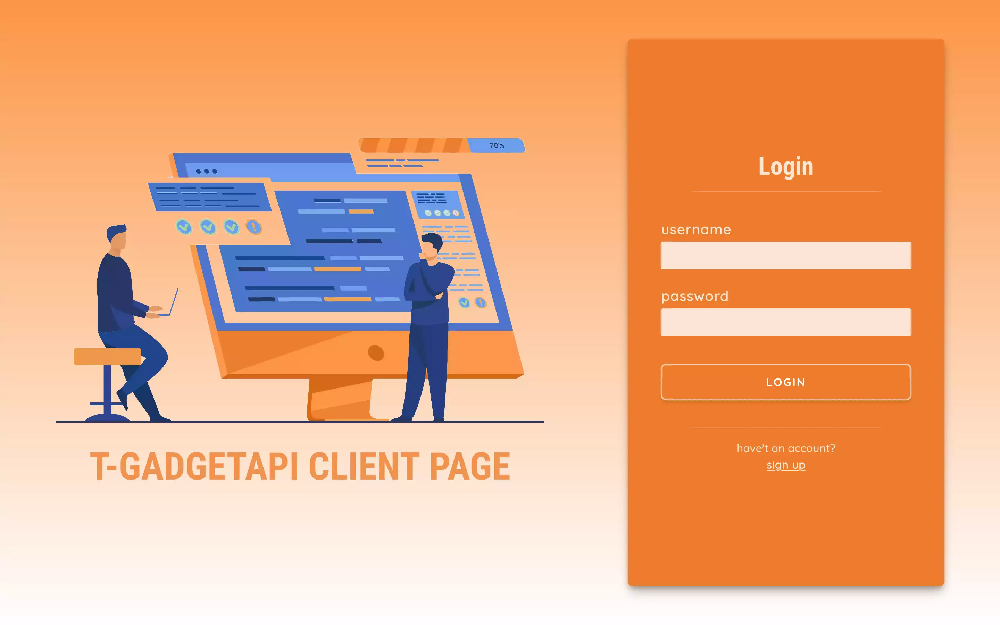
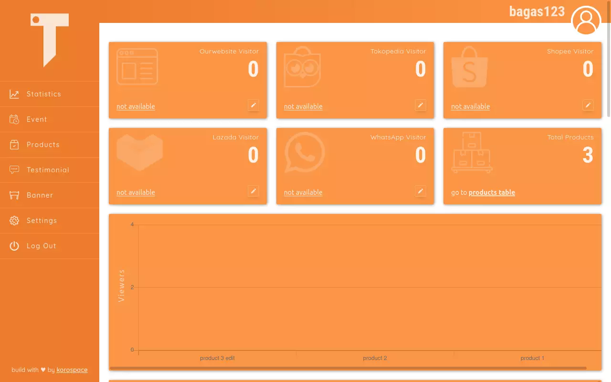
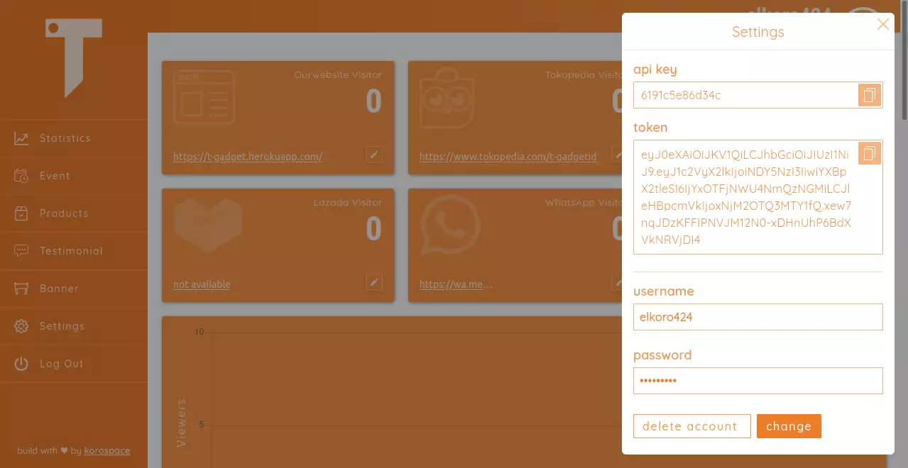
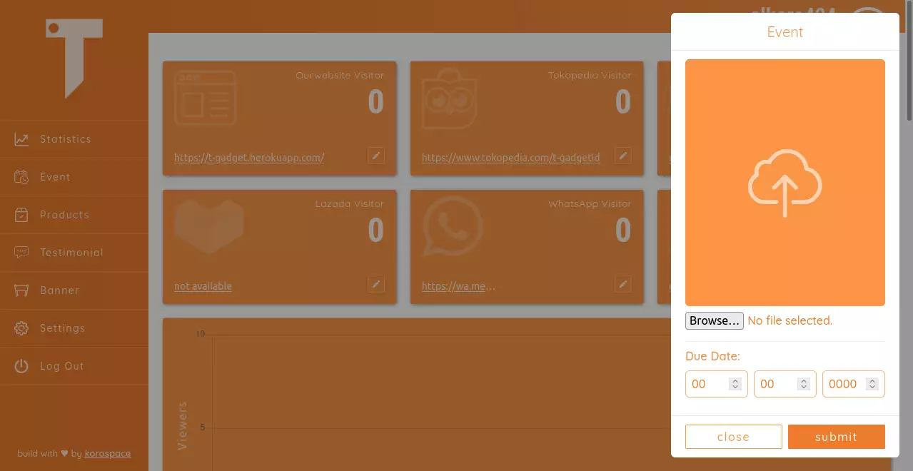
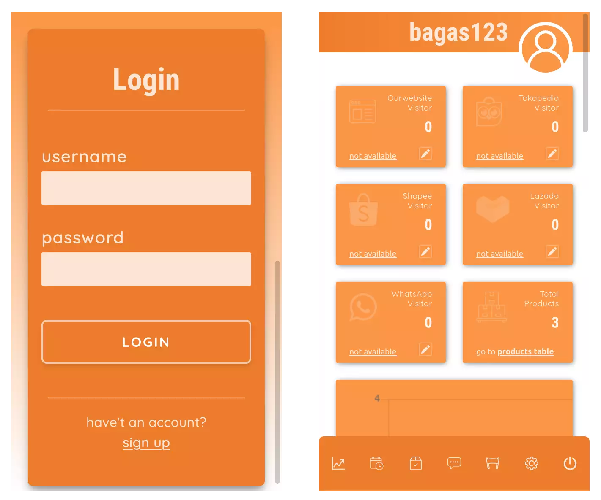

# T-Gadgetid Admin Page
This is a website that I created as GUI for manage my rest API at <a href="https://api-tgadget.up.railway.app/">https://api-tgadget.up.railway.app/</a>

## 1. Tools & Stack
- [x] vuejs
- [x] Tailwind

## 2. Preview
Live Demo Can access at <a href="https://t-gadgetadmin.netlify.app/">https://t-gadgetadmin.netlify.app/</a>   

>   

>   

>   

>   

>   
